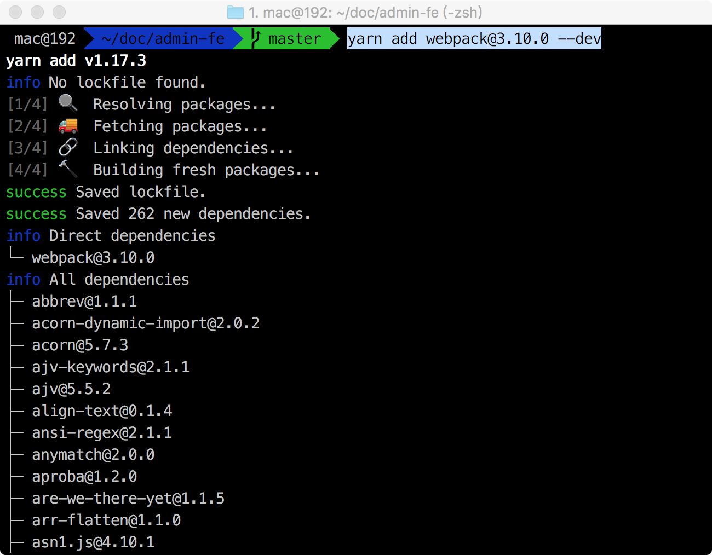
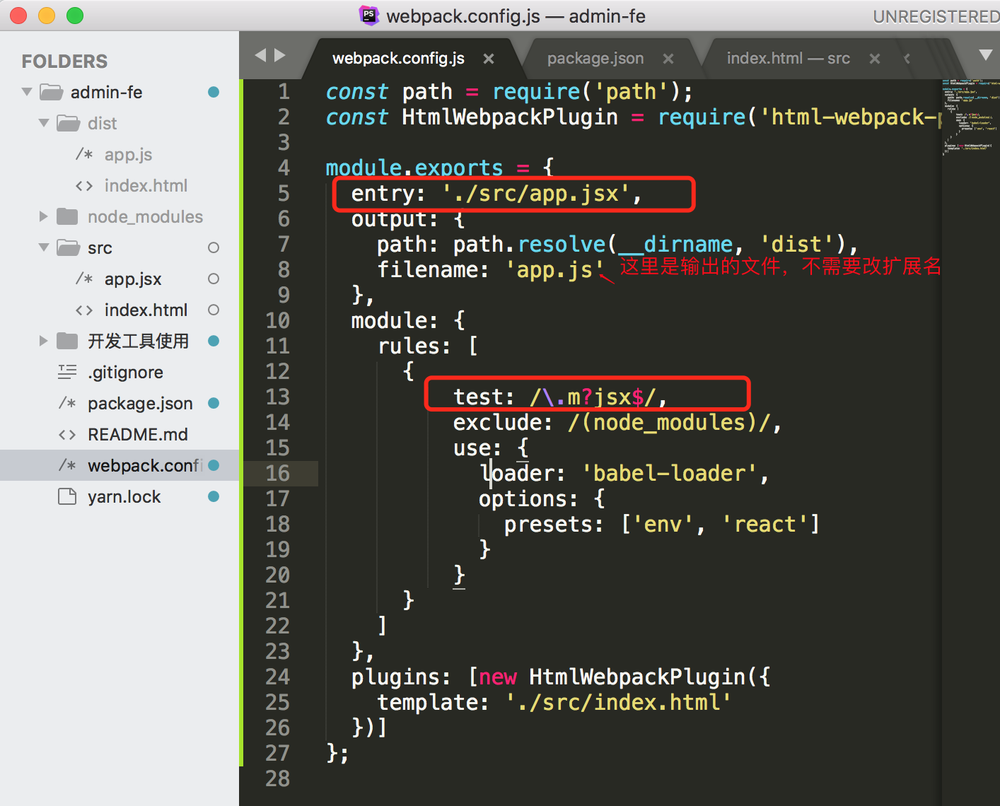

# 使用yarn初始化项目、webpack的配置

## 一、在项目的根目录下输入`yarn init`

可以看到生成了一个package.json文件，里面存储了一些项目的信息。在生成过程中，需要输入的地方直接按回车就行了，既使用默认名称，不另做修改。


## 二、将package.json上传到Git上


## 三、在项目跟目录下使用命令`yarn add webpack@3.10.0 --dev`添加webpack




过四十几秒后，生成了一个yarn.lock文件和node_modules文件夹，可以看到这个文件夹里很多文件。


# 四、创建webpack.config.js,进行webpack配置

在项目中新建一个文件夹src，存放源代码，并且在该文件夹下建一个app.js文件，作为webpack.config.js的入口文件，随便写一句内容:`console.log("hello webpack");`。然后在项目中增加一个文件`webpack.config.js`，内容如下：

```js
const path = require('path');

module.exports = {
  entry: './src/app.js',
  output: {
    path: path.resolve(__dirname, 'dist'),
    filename: 'app.js'
  }
};
```

在命令行使用刚才安装的webpack进行打包编译，输入命令`node_modules/.bin/webpack`


打包成功了，可以看到项目中多了一个dist文件夹：


# 五、安装html-webpack-plugin

在webpack.config.js中增加HTML配置：


然后在命令行输入`yarn add html-webpack-plugin@2.30.1 --dev`


然后看到项目的dist文件夹中多了一个index.html文件：


如果想自定义index.html模板呢，

可以在webpack.config.js的HtmlWebpackPlugin中增加一个参数，参数中指定了模板文件：


这个模板文件在src下面，index.html文件，内容如下：


然后回到命令行再次执行`node_modules/.bin/webpack`进行打包编译：


回到项目中可以看到dist文件夹中多了一个index.html文件，是我们指定的模板，并且把我们的app.js也引入进来了。


# 六、处理脚本，安装babel-loader

在webpack.config.js中增加处理脚本的rules：

```js
 module: {
	rules: [
	  {
	      test: /\.m?js$/,
	      exclude: /(node_modules)/,
	      use: {
	        loader: 'babel-loader',
	        options: {
	          presets: ['env']
	        }
	      }
	  }
	]
  },
```

如图所示,这个图是我操作完react才添加的，第18行代码参照上面的，不要参考下图，下图中18行多了'react'：


然后将src/app.js中的console改成ES6的语法：

```js
let a = 2;
let test = (value) => {
	return value * 2;
};
test(a);
```

然后在命令行安装babel，输入命令：`yarn add babel-core@6.26.0 babel-preset-env@1.6.1 babel-loader@7.1.2 --dev`，然后打包编译：`node_modules/.bin/webpack`

编译完成后在dist/app.js中的末尾可以看到刚才src/app.js中的ES6的代码也被babel成功转化成ES5的代码了：

```js
var a = 2;
var test = function test(value) {
	return value * 2;
};
test(a);
```

在package.json中可以看到增加了刚才安装的插件：


要增加使用react则安装react的依赖包，在命令行输入：`yarn add babel-preset-react@6.24.1 --dev`，再将react放到我们这个已存在的项目中：`yarn add react@16.2.0 react-dom@16.2.0`


然后在webpack.config.js中的18行presets的'dev'后面增加'react'，也就是上面倒数第三个截图.

接下来将src/app.js的扩展名改成`jsx`,然后将里面的内容改成React的内容来进行测试，src/app.jsx的内容如下：

```jsx
import React from 'react';
import ReactDOM from 'react';

ReactDOM.render(
	<h1>Hello, world!</h1>,
	document.getElementById('app')
);
```

然后将webpack.config.js的入口文件改为./src/app.jsx和解析的文件扩展名改为jsx.

Webpack.config.js此时的全部内容如下：



然后去命令行执行编译，编译后会发现dist/app.js内容增加了很多。接着在浏览器上打开index.html,就可以看到此时的结果了：


# 七、配置样式，安装style-loader和CSS-loader

在命令行输入`yarn add style-loader@0.19.1 css-loader@0.28.8 --dev`

在webpack.config.js的rules里面加入：

```json
	  	{
        test: /\.css$/i,
        use: ['style-loader', 'css-loader'],
      },
```

然后在src文件夹中新建一个index.css文件，并写入一个样式：

```css
#app{
	color: red;
}
```

然后在src的app.jsx里面导入样式文件：

```jsx
import React from 'react';
import ReactDOM from 'react';
import './index.css';
ReactDOM.render(
	<h1>Hello, world!</h1>,
	document.getElementById('app')
); 
```

接下来重新编译运行，在命令行输入`node_modules/.bin/webpack`

编译完成后，在浏览器上打开dist/index.html，可以看到页面的字体变成了红色，说明样式文件起了作用：


此时我们发现样式是写在了app.js里面，用脚本的方式引入样式的。脚本是在页面加载完才执行，那样式放在脚本里会使得页面加载过程中出现较长时间的空白，影响用户体验。我们可以将样式提取到css文件中，这样就会在页面加载时渲染了。

可以使用extract-text-webpack-plugin这个插件来做到这一点，在命令行输入：`yarn add extract-text-webpack-plugin@3.0.2 --dev`,然后在webpackage.config.json中的头部导入:`const ExtractTextPlugin = require('extract-text-webpack-plugin');` ，rules中的css的use替换成下面的：

```js
use: ExtractTextPlugin.extract({
  fallback: "style-loader",
  use: "css-loader"
})
```

plugins中增加插件的调用：`new ExtractTextPlugin("index.css")`.

最终webpack.config.js如下：


然后编译运行，就可以看到dist文件夹下多了一个index.css文件，然后在浏览器中查看dist/index.html文件，然后查看网页源代码：


可以看到index.html中引入了index.css.

# 八、配置sass样式，安装sass-loader和node-sass

在命令行输入：`yarn add node-sass@4.7.2 --dev`、`yarn add sass-loader@6.0.6 --dev`

> 小提醒，我在安装node-sass的时候选择4.7.2和4.0.0都失败了，最后没有指定版本反而成功了。也就是直接执行`yarn add node-sass --dev`

在src文件夹下新建一个index.scss文件，注意sass文件的扩展名是scss，内容如下：

```scss
body{
	background: #ccc;
	#app{
		font-size: 100px;
	}
}
```

然后src/app.js中引入index.scss:

```js
import React from 'react';
import ReactDOM from 'react';
import './index.css';
import './index.scss';
ReactDOM.render(
	<h1>Hello, world!</h1>,
	document.getElementById('app')
); 
```

webpack.config.js中的rule增加sass文件的处理：

```js
			{
        test: /\.scss$/i,
        use: ExtractTextPlugin.extract({
          fallback: "style-loader",
          use: ["css-loader", "sass-loader"]
        })
      },
```

最终webpack.config.js的代码如下：


然后使用命令`node_modules/.bin/webpack`打包编译，完成后在浏览器上打开dist/index.html页面，可以看到背景和字号都发生了变化。


# 九、图片的加载:安装file-loader和url-loader

在命令行执行:`yarn add file-loader@1.1.6 url-loader@0.6.2 --dev`

然后往src路径下放一张图片1.png

将src/index.scss中的背景色#ccc改成url(1.png)

Webpack.config.js中增加对图片的处理：

```js
			{
        test: /\.(png|jpg|gif)$/i,
        use: [
          {
            loader: 'url-loader',
            options: {
              limit: 8192,
            },
          },
        ],
      },
```

然后进行打包编译，发现dist文件夹多了一个我们刚才放到src下面的1.png图片，只不过这个图片名已经被加密处理过了。在浏览器中打开dist/index.html，可以看到图片已经生效了：


# 十、字体库的加载：安装font-awesome

在命令行执行：`yarn add font-awesome`
（如果后期直接用CSN不用本地安装包，那就用`yarn remove font-awesome`来卸载掉）
在src/app.jsx中增加一个font-awesome标签`<i className='fa fa-address-book'></i>`，并且导入css字体文件，如下所示：

```jsx
import React from 'react';
import ReactDOM from 'react-dom';

import 'font-awesome/css/font-awesome.min.css'
import './index.css';
import './index.scss';
ReactDOM.render(
	<div>
		<i className='fa fa-address-book'></i>
		<h1>Hello, world!</h1>
	</div>,
	document.getElementById('app')
); 
```

然后在webpack.config.js中增加字体处理部分：

```js
			{
        test: /\.(eot|svg|ttf|woff|woff2|otf)$/i,
        use: [
          {
            loader: 'url-loader',
            options: {
              limit: 8192,
            },
          },
        ],
      },
```

然后编译运行，就可以看到dist文件夹下多了许多字体文件：


然后我们在浏览器打开dist/index.html就可以看到字体图标了：


# 十一、提出公共模块：CommonsChunkPlugin

在webpack.config.js中使用webpack自带的CommonsChunkPlugin提取公共模块，将生成的css代码放到css文件夹，js代码分app.js和base.js放到js文件夹，字体文件和图片放到resource文件夹。最终webpack.config.js的代码如下。有的是新增的代码，有的是在刚才的基础上修改的。

```js
const path = require('path');
const HtmlWebpackPlugin = require('html-webpack-plugin');
const ExtractTextPlugin = require('extract-text-webpack-plugin');
const webpack = require("webpack");// 新增

module.exports = {
  entry: './src/app.jsx',
  output: {
    path: path.resolve(__dirname, 'dist'),
    filename: 'js/app.js'// 修改
  },
  module: {
	rules: [
	  // react(jsx)语法的处理
	  {
	      test: /\.m?jsx$/,
	      exclude: /(node_modules)/,
	      use: {
	        loader: 'babel-loader',
	        options: {
	          presets: ['env', 'react']
	        }
	      }
	  },
	  // css文件的处理
	  {
        test: /\.css$/i,
        use: ExtractTextPlugin.extract({
          fallback: "style-loader",
          use: "css-loader"
        })
      },
      // sass文件的处理
      {
        test: /\.scss$/i,
        use: ExtractTextPlugin.extract({
          fallback: "style-loader",
          use: ["css-loader", "sass-loader"]
        })
      },
      // 图片的处理
      {
        test: /\.(png|jpg|gif)$/i,
        use: [
          {
            loader: 'url-loader',
            options: {
              limit: 8192,
              name: 'resource/[name].[ext]'// 修改
            },
          },
        ],
      },
      // 字体图标的处理
      {
        test: /\.(eot|svg|ttf|woff|woff2|otf)$/i,
        use: [
          {
            loader: 'url-loader',
            options: {
              limit: 8192,
              name: 'resource/[name].[ext]' // 修改
            },
          },
        ],
      },
	]
  },
  plugins: [
  	  // 处理html文件
	  new HtmlWebpackPlugin({
	  	template: './src/index.html'
	  }),
	  // 独立css文件
	  new ExtractTextPlugin("css/[name].css"),
	  // 提出公共模块
	  new webpack.optimize.CommonsChunkPlugin({// 新增
	  	name: 'common',
	  	filename: 'js/base.js'
	  })
  ]
};

```

然后我们把之前生成的dist文件夹删掉。再打包编译：`node_modules/.bin/webpack`

编译好后我们看到dist文件夹已经更新了：


# 十二、启动webpack-dev-server,修改代码实时更新网页

在命令行输入：`yarn add webpack-dev-server@2.9.7 --dev`

在webpack.config.js文件中的plugins同级的对象：

```js
devServer: {
      contentBase: './dist'
  },
```

然后在命令行通过`node_modules/.bin/webpack-dev-server`命令来启动webpack服务：


可以看到命令行提示这几句，指明了webpack server的端口号：

Project is running at http://localhost:8080/
webpack output is served from /
Content not from webpack is served from ./dist

我们可以在浏览器上打开http://localhost:8080/


我们发现字体文件和背景图片没有了，打开浏览器控制台，发现报错了：


鼠标悬浮上去发现路径不对，原来是我们的服务是在根目录启动的。所以我们的文件引用也应该从根目录开始。

我们需要在webpack.config.js中的output中指定publicPath:`publicPath: '/dist/',`,此外devServer中的`contentBase: './dist'`就可以不要了.在publicPath中增加了`/dist/`，就相当于在生成dist文件夹后的index.html中的`<script type="text/javascript" src="js/base.js"></script><script type="text/javascript" src="js/app.js"></script>`引用的js文件路径前增加了`/dist/`，

效果等同于：`<script type="text/javascript" src="/dist/js/base.js"></script><script type="text/javascript" src="/dist/js/app.js"></script>`

然后在终端重新执行打包编译命令：`node_modules/.bin/webpack-dev-server`,这时候我们直接访问http://localhost:8080/dist/index.html地址：背景和图标就出来了，说明路径没问题


**现在改代码一保存就网页就实时变化了,增加了开发速度**

接下来我们用一个别的端口，因为8080端口许多东西都在用，比如Apache、Tomcat。

我们可以在webpack.config.js中的devServer中指定端口：`port: 8086`.

保存文件重新启动即可,就可以发现端口号变成了8086了。


然后在浏览器打开http://localhost:8086/dist/index.html,如果发现控制台报错说找不到favicon.ico文件，则放一张图片命名为favicon.ico到项目的根目录下就好。

# 十二、在package.json中增加命令脚本

```js
"scripts": {
    "dev": "node_modules/.bin/webpack-dev-server",
    "dist": "node_modules/.bin/webpack"
  },
```


保存一下后在命令行执行`yarn run dev`，我们发现执行的就是`node_modules/.bin/webpack-dev-server`


同理，如果输入`yarn run dist`则是执行`node_modules/.bin/webpack`.如果是在线上环境的话，可以在脚本中，node_modules/.bin/webpack后面加一个` -p`.

-----

最终代码webpack.config.js代码见:[webpack.config.js](../webpack.config.js)

package.json代码见：[package.json](../package.json)